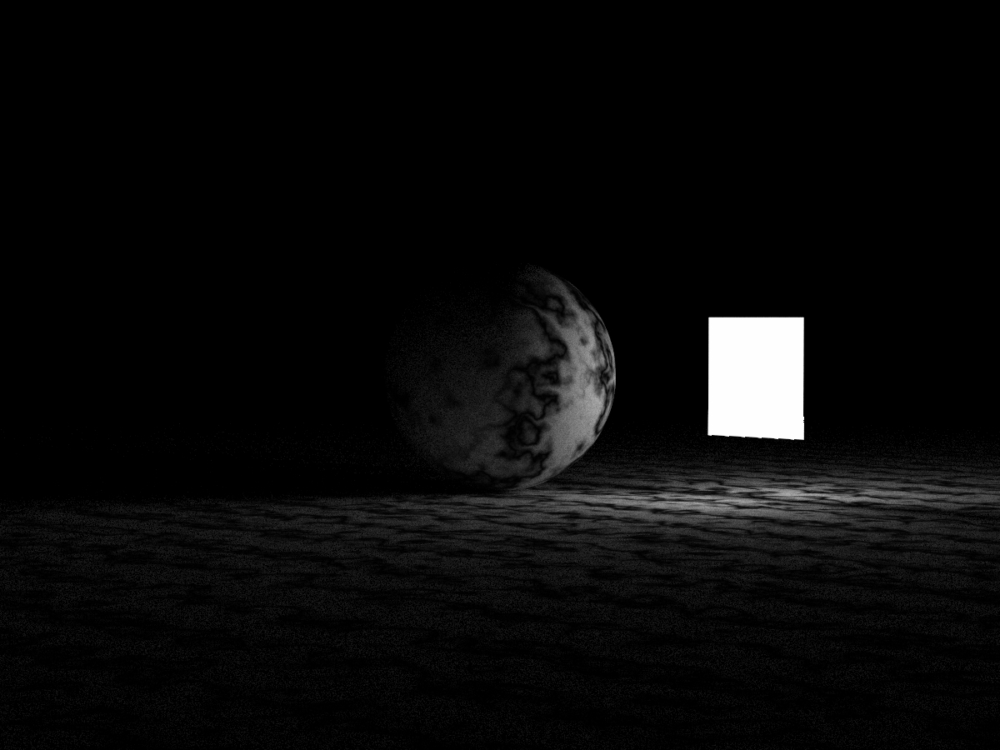

# ray-tracer
Based on the [Ray Tracing in One Weekend](https://raytracing.github.io/) series, extended with multithreading support for increased performance.

## Renders

800x800, 1000 samples per pixel
Render time @ 12 threads: 1hr 16min

CPU: Intel i5 12400F (6C/12T) @ 4.3GHz

1200x900, 1000 spp
Render time @ 16 threads: 27:56 min

CPU: Intel i5 12400F (6C/12T) @ 4.3GHz

# Roadmap
| Milestone | Status |
| - | - | 
| Cornell Box | ✅ done | 
| multithreading | ✅ done | 
| SIMD | 📋 planned |
| RV32G (RV32IMAFD) | 📋 planned | 
| Test suite | 📋 planned | 
| Third book | 📋 planned | 
| [Ray Tracing: GPU Edition](https://raytracing.github.io/gpu-tracing/book/RayTracingGPUEdition.html) | 📋 planned | 
| real-time output (via SDL2 or imgui) | 💡 idea | 
| Vulkan mode | 💡 idea |

